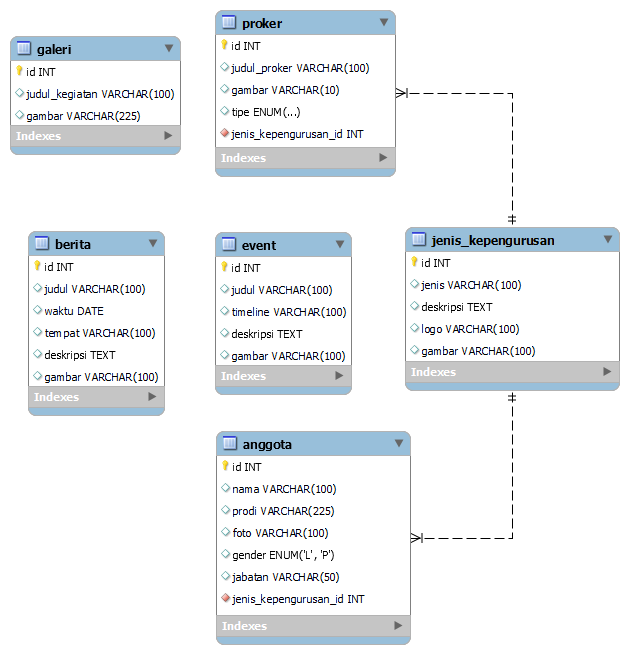

ERD WEB BEM



PERSIAPAN 

1. Bikin Database 
```
Nama Database : bemvokasi
```

2. Generate Key
```
php artisan key:generate
```

3. NPM 
```
npm install
```

```
npm ci
```

```
npm run dev
```

4. Run Migrate Database
```
php artisan migrate
```

5. Run Project
```
php artisan serve
```

MASUK HALAMAN DASHBOARD
```
Register Akun di localhost:8000/register lalu langsung login di localhost:8000/login
```
